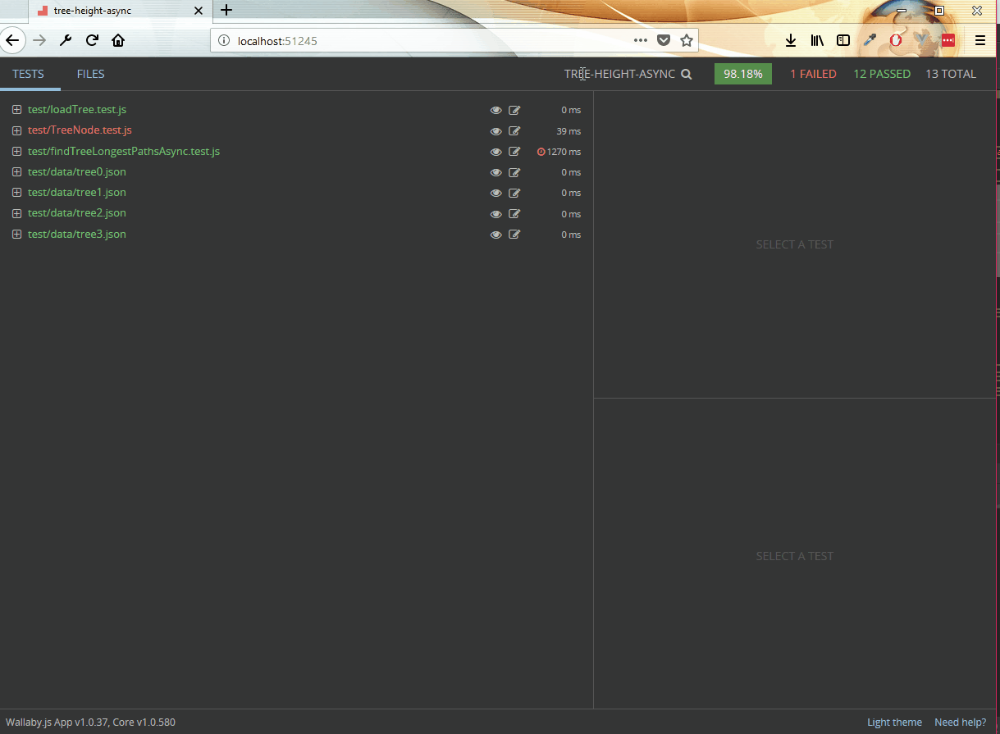

# Vivint Bowling

### What is this?

An example of a bowling manager utilizing GraphQL/Prisma and Vue. You'll never have higher scores with
an app that lets you bowl a 5 / 7 ;).

Equipped with Wallaby:

---

### Getting Started - Prisma Service

PRE) You'll need a few npm dependencies and docker installed in order to run the Prisma service.

1) npm install -g prisma graphql-cli
2) `$ cd prisma && prisma local start && prisma deploy`

That's it. Prisma is up and running in a couple of containers and the database has been
setup with the definitions in the `datamodel.graphql` file.

-----

### Getting Started - UI

The client is just a simple @vue/cli app that hits Prisma directly (Don't do this in prod)

1) `$ npm install -g @vue/cli`
1) `$ cd ui && npm install` 
4) `$ npm run serve`

-----

### Testing

:feelsgood: - but no seriously there's like an example in there somewhere.

###### SOON™
